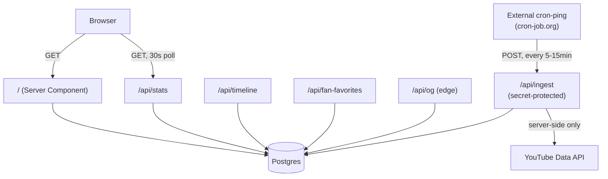

# Architecture

## Overall architecture

GetTheMoon V2 is a Next.js 16 App Router application with a Postgres data
layer, deployed on Vercel. It replaces V1's single 60KB `index.html` plus
zero-config Vercel Functions with a componentized app, but keeps V1's core
security shape intact: **the browser never talks to YouTube, ever.**



Two independent data flows meet only at Postgres:

1. **Read path** — the browser and the page itself read from Postgres,
   directly or via the site's own `/api/*` routes. Fast, cheap, no
   external calls on the request path.
2. **Write path** — a scheduled external service calls `/api/ingest`,
   which is the only code in the entire project allowed to call YouTube.

## Folder structure

```
app/
  layout.tsx              Root layout — fonts, Atmosphere, Header, Footer
  page.tsx                Composition root — fetches data, renders sections
  globals.css              Design tokens, keyframes, Tailwind import
  api/
    stats/route.ts         Public, read-only
    timeline/route.ts      Public, read-only
    fan-favorites/route.ts Public, read-only
    og/route.tsx            Public, read-only, edge runtime
    ingest/route.ts         Internal, secret-protected, write

components/
  atmosphere/    Fixed background layer (Starfield, Nebula, ShootingStar)
  hero/          Avatar, subscriber count, tagline
  milestone/     100K→500K progress path and carousel
  timeline/      Content journey rail and nodes
  content/       Shared card/glyph primitives used by timeline + uploads
  stats/         Stats row, social links
  layout/        Header, Footer
  data/          LiveStatsSync — client-side store hydration, no UI
  ui/            Design-system primitives (Container, GlassPanel, Pill,
                 SectionLabel, SectionHeading, AnimatedNumber)

lib/
  milestones.ts  Single source of truth for the chapter config
  types.ts       Shared ContentItem / ChannelStats types
  db.ts          Postgres client
  youtube.ts     YouTube Data API client — server-only
  ingest.ts      Shared ingestion logic (called by the route AND the script)
  data.ts        Server-side data fetchers used directly by page.tsx
  format.ts      Shared date/time formatting
  platforms.ts   Static social link config
  store.ts       Zustand store for live-polled channel stats

db/schema.sql    Postgres schema
scripts/ingest.ts  Local test entry point for the ingestion job
```

Components are grouped by **feature**, not by type — `hero/` holds every
piece specific to the hero, rather than scattering `AvatarOrbit`,
`SubscriberCount`, and `Tagline` across generic `components/` and
`components/atoms/`-style buckets. `ui/` is the one type-based exception:
those are genuinely cross-cutting primitives with no feature affinity.

## Data flow

**Initial page load:** `page.tsx` (a Server Component) calls
`getChannelStats()` and `getContentItems()` from `lib/data.ts` directly —
querying Postgres in-process, not through its own `/api/stats` route. This
avoids a self-inflicted HTTP round-trip for data the server already has
direct access to.

**Live updates without a reload:** `LiveStatsSync` (mounted once, in
`page.tsx`) hydrates a Zustand store with the server-fetched initial value,
then polls `/api/stats` every 30 seconds. `SubscriberCount` and
`MilestoneJourney` both read from that same store — not from two
independent polls — so they can't drift out of sync with each other after
the first refresh.

**Background writes:** the external cron service calls `/api/ingest`,
which calls `lib/ingest.ts`'s `runIngest()` — the same function
`scripts/ingest.ts` calls locally for testing. One implementation, two
callers, not two implementations to keep in sync.

## Rendering strategy

- `/` is `export const dynamic = "force-dynamic"` — server-rendered on
  every request, never statically cached at the page level. This is
  deliberate: the whole product promise is a live number, so
  build-time-frozen HTML would be actively wrong.
- Every data-reading API route is also `force-dynamic`, for the same
  reason, and because `lib/db.ts`'s Postgres client can't be safely
  evaluated as part of static generation without real credentials present
  (see `lib/db.ts`'s own comment on this).
- `/api/og` additionally runs on the **edge runtime** — OG image
  generation via `@vercel/og` requires it.
- Freshness is handled at the HTTP cache layer instead
  (`Cache-Control: s-maxage=…, stale-while-revalidate=…` per route — see
  `API_REFERENCE.md`), not by Next.js's page-level static/ISR machinery.

## Client vs. server responsibilities

**Server-only, never bundled to the client:**
`lib/youtube.ts`, `lib/ingest.ts`, `lib/db.ts`, every file under `app/api/`.

**Server Components by default** (zero client JS unless listed below):
`page.tsx`, `layout.tsx`, `Header`, `Footer`, `Hero`, `AvatarOrbit`,
`OrbitRing`, `OrbitingBody`, every card/glyph in `components/content/`,
`StatsRow`, `SocialLinks`, `ContentTimeline`, `RecentUploads`,
`FanFavorites`, and every primitive in `components/ui/` **except**
`AnimatedNumber`.

**Client Components** (`"use client"`, genuinely need state, effects, or
browser APIs):
- `SubscriberCount`, `MilestoneJourney` — read from the live Zustand store
- `MilestoneCarousel` — local `segmentIndex` state
- `TimelineNode` — hover/focus/open state, keyboard handling
- `LiveStatsSync` — the poller itself; renders nothing
- `AnimatedNumber` — wraps NumberFlow, which needs state for digit transitions
- `Starfield`, `ShootingStar` — canvas/timer-driven, need browser APIs
- `GravityParticles` — no state, but colocated with the other AvatarOrbit
  animation pieces for consistency

Every other animation in the project (`OrbitRing`, `OrbitingBody`, `Nebula`,
the milestone marker's pulse) is plain CSS `@keyframes` on Server
Components — no client JS needed for continuous, non-interactive motion.

## Background jobs

One background job: ingestion, triggered externally (see
`DEPLOYMENT.md` §3 for why an external pinger was chosen over Vercel's
built-in Cron or GitHub Actions' `schedule` trigger). It is not a
Vercel Cron Job, not a queue, not a persistent worker — it's a stateless
POST endpoint that does its work and returns, matching serverless
function constraints.

## Caching strategy

Three layers, each doing a different job:

1. **HTTP caching** (`Cache-Control` headers on each GET route) — the
   first line of defense against redundant Postgres queries from repeat
   visitors and platform crawlers.
2. **Postgres itself** — the actual source of truth, updated only by
   ingestion, read constantly. No Redis or KV layer in front of it; at
   this traffic scale, Postgres queried by fast serverless functions is
   sufficient (see the architecture plan for the fuller reasoning on why
   a caching layer wasn't added preemptively).
3. **Client-side store** (Zustand) — avoids redundant `fetch` calls
   *within* an already-open tab; `SubscriberCount` and `MilestoneJourney`
   share one poll instead of running two.

There is no build-time caching of page content — see Rendering Strategy
above for why that's deliberate here, not an oversight.
