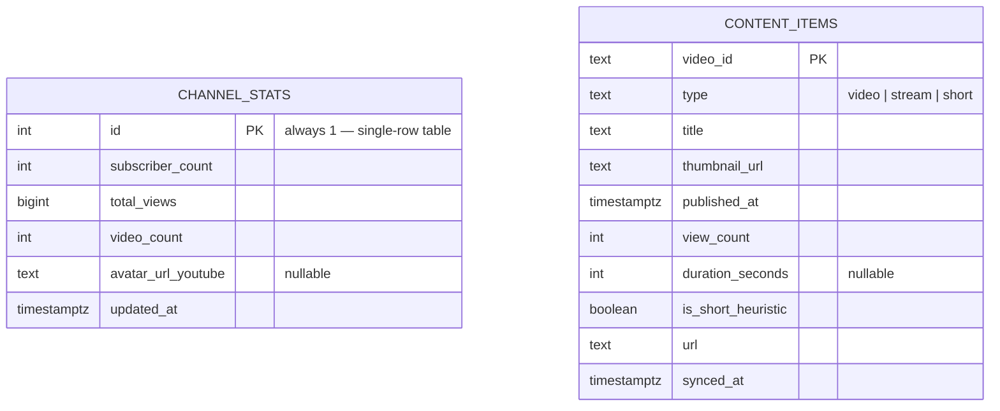

# Database Schema

Source of truth: `db/schema.sql`. This document explains it; the SQL file
is authoritative if the two ever disagree.

## ER diagram



No foreign key relationship is drawn between them because there isn't
one — this is intentional, not an omission. See "Why no relationship"
below.

## Tables

### `channel_stats`

A **single-row table** — `id` is constrained to always equal `1`
(`constraint single_row check (id = 1)`). There is exactly one channel
being tracked, so there's exactly one row, upserted in place on every
ingestion run rather than accumulating a history table.

| Column | Type | Nullable | Notes |
|---|---|---|---|
| `id` | `integer` | no | PK, always `1` |
| `subscriber_count` | `integer` | no | From `channels.list.statistics.subscriberCount` |
| `total_views` | `bigint` | no | `bigint`, not `integer` — a long-running channel's lifetime view count can exceed `integer`'s ~2.1 billion ceiling well before subscriber count ever would |
| `video_count` | `integer` | no | Total tracked content items, not just long-form |
| `avatar_url_youtube` | `text` | **yes** | Null before the first successful ingestion run; the frontend renders a gradient-circle fallback in that case (see `AvatarOrbit.tsx`) |
| `updated_at` | `timestamptz` | no | Set via `now()` on every upsert, never client-supplied |

### `content_items`

One row per tracked video, stream, or short.

| Column | Type | Nullable | Notes |
|---|---|---|---|
| `video_id` | `text` | no | PK — the actual YouTube video ID |
| `type` | `text` | no | `check (type in ('video','stream','short'))` — enforced at the DB level, not just in TypeScript |
| `title` | `text` | no | |
| `thumbnail_url` | `text` | no | |
| `published_at` | `timestamptz` | no | Drives both the timeline's chronological order and the `WHERE published_at >= chapterStartDate` filter |
| `view_count` | `integer` | no | Default `0` |
| `duration_seconds` | `integer` | **yes** | Null is possible if YouTube's API omits `contentDetails.duration` for a given item; `classify()` in `lib/ingest.ts` treats a missing/zero duration as "not a Short" rather than crashing |
| `is_short_heuristic` | `boolean` | no | Named `_heuristic` deliberately — see `SECURITY.md`/`TODO_V2.md` for why Shorts detection can never be exact |
| `url` | `text` | no | Full `https://www.youtube.com/watch?v=…` link |
| `synced_at` | `timestamptz` | no | Last time this specific row was touched by ingestion |

## Indexes

```sql
create index if not exists idx_content_items_published_at
  on content_items (published_at desc);

create index if not exists idx_content_items_type_views
  on content_items (type, view_count desc);
```

- `idx_content_items_published_at` — serves `/api/timeline`'s
  `ORDER BY published_at DESC LIMIT 40` directly.
- `idx_content_items_type_views` — a composite index serving
  `/api/fan-favorites`'s `WHERE type = 'video' ORDER BY view_count DESC`
  in one index scan rather than a filter-then-sort.

No index on `channel_stats` beyond the primary key — a single-row table
has nothing for an index to meaningfully speed up.

## Why no relationship between the two tables

They're populated by the same job but represent genuinely independent
facts: "how many subscribers right now" and "what content exists." Forcing
a foreign key between them would imply a relationship that isn't real —
neither table's rows reference the other's. This was a deliberate call
made during architecture planning, not an oversight surfacing here for the
first time.

## Reconciliation (why rows disappear, not just appear)

Every ingestion run fetches the channel's **complete current** upload list
and deletes any `content_items` row not present in that fetch:

```sql
delete from content_items where video_id != all(${currentIds})
```

This is what makes "removed from YouTube → removed from the site" work.
It was tested against a real local Postgres instance during the
production review (see `FINAL_REVIEW.md`), seeded with fake data
simulating a deletion — not just read as correct.

## Future migration notes

- **No migration tool is set up.** `schema.sql` uses `create table if not
  exists` specifically so it's safe to re-run, which works for this
  project's current size and change cadence, but doesn't track schema
  *history* the way a tool like Drizzle Kit or node-pg-migrate would. If
  the schema grows more complex, introduce one before it becomes painful
  to retrofit — not after.
- **Adding a real Shorts flag, if YouTube ever ships one:** `type` and
  `is_short_heuristic` are already separate columns specifically so a
  future migration could add a third signal (e.g.
  `is_short_confirmed_by_api`) without touching the existing two, and
  `lib/ingest.ts`'s `classify()` is the single place that would need to
  change.
- **If a full content history view is ever built** (beyond the current
  sliding window), the `content_items` table already stores everything —
  `/api/timeline`'s `LIMIT 40` is an application-layer choice, not a
  storage-layer one. No migration needed, only a new paginated query.
- **If `channel_stats` ever needs to track history** (e.g., a subscriber
  count graph over time) rather than just current state, that's a new
  table, not a modification to this one — `channel_stats` should stay a
  single-row "current state" table by design.
